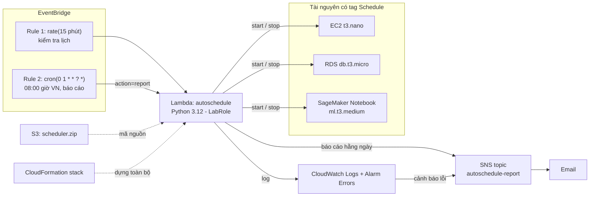
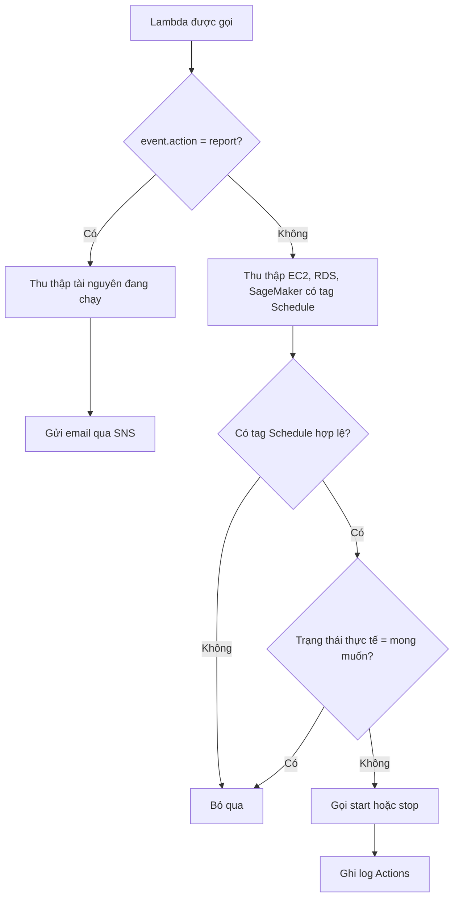

# Kiến trúc AutoSchedule

> Sơ đồ dùng Mermaid, GitHub tự hiển thị. Khi cần nộp báo cáo, chụp ảnh sơ đồ này hoặc vẽ lại bằng draw.io.

## Luồng xử lý của Lambda

## Quy ước tag

| Tag | Ví dụ | Ý nghĩa |
|---|---|---|
| `Schedule` | `08:00-17:00`, `22:00-06:00`, `off` | Khung giờ chạy |
| `ScheduleDays` | `Mon-Fri` | Ngày chạy (mặc định cả tuần) |
| `Project` | `AutoSchedule` | Bắt buộc theo đề |
| `Owner` | `sv01` | Bắt buộc theo đề |
